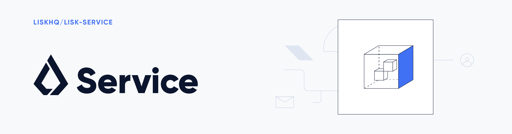

# Lisk Service

Lisk Service is a web application that allows interaction with various blockchain networks based on Lisk and Bitcoin protocols.

The main focus of Lisk Service is to provide data to the UI clients such as Lisk Desktop and Lisk Mobile. Lisk Service makes it possible to access all live blockchain data in a similar manner to the regular Lisk SDK API. 
In addition, Lisk Service also provides users with much more detailed information and endpoints, such as geolocation and various statistics about network usage, etc.

The project implementation is based on Microservices. The technical stack is designed to deliver several micro-services, and each of them provides one particular functionality. The data is served in JSON format and exposed by a public RESTful API.

## Available Services

Lisk Service consists of several separate modules, that can be run independently from the others. The Gateway is required to expose the APIs provided by the specific services.

Each service is an independent part of the repository and is placed in a separate directory in the `./services/` directory. Each of them contains its own `package.json` and `Dockerfile` that are needed to run the module.


| Service                  | Description                                                                                                       |
| -------------------------- | ----------------------------------------------------------------------------------------------------------------- |
| [Gateway](services/gateway) | The Gateway provides the API, which all users of Lisk Service can access and use. Its main purpose is to proxy API requests from users to other services provided by Lisk Service. This provides the users with a central point of data access that never breaks existing application compatibility.|
| [Lisk](services/core) | The Lisk Core service acts as a bridge between the Lisk Core and the Lisk Service API. Its main purpose is to provide enriched data from the Lisk Core API. This service is aimed at providing high availability, and both efficient and reliable access to the Lisk Core API. |
| [Market](services/market) | The Market service allows price data retrieval. It supports multiple sources to keep the current Lisk token price up-to-date and available to the clients. |
| [Newsfeed](services/newsfeed) | The Newsfeed service is a single-purpose microservice that polls the content sharing platforms and shares collected data with UI clients such as Lisk Desktop |
| [Template](services/template) | The Template service is an abstract service that all of Lisk Service services are inherited from. It allows all services to share a similar interface and design pattern. Its purpose is to reduce code duplication and increase consistency between each service, hence simplifying code maintenance and testing. |

**Remarks**

- Lisk Service is configured to connect a local node via WebSocket on port 8080 by default.
- The default installation method is based on Docker.
- Some token conversion rates in the market service require their own API keys.

## API documentation

The Gateway service provides the following APIs, which all users of Lisk Service can access and use.

| API                      | Description                                                                                                   |
| ------------------------------ | ------------------------------------------------------------------------------------------------------------- |
| [HTTP API](docs/api/version2.md)     | HTTP API is the public RESTful API that provides blockchain data in standardized JSON format.   |
| [WebSocket JSON-RPC API](docs/api/version2.md)     | The WebSocket-based JSON-RPC API provides blockchain data in standardized JSON format. The API uses the socket.io library and it is compatible with JSON-RPC 2.0 standard.   |
| [Subscribe API](docs/api/websocket_subscribe_api.md)     | The Subscribe API is an event-driven API. It uses a two-way streaming connection, which can notify the client about new data instantly as it arrives. It is responsible for updating users regarding changes in the blockchain network and markets.   |

## Installation

The default port for REST API requests and Socket.io-based communication is `9901`, it is possible to access it through the URL http://localhost:9901/. The REST API can be accessed by any HTTP client such as [Postman](https://www.postman.com/), [cURL](https://curl.haxx.se/) and [HTTPie](https://httpie.org/).

WebSocket-based APIs can by used through a [socket.io](https://socket.io/) library available for many modern programming languages and frameworks.

To continue the installation ensure that you have the following dependencies installed:
- [Docker](https://www.docker.com/) with [Docker compose](https://docs.docker.com/compose/install/)
- [GNU Make](https://www.gnu.org/software/make/) and [GNU Tar](https://www.gnu.org/software/tar/)

Follow the instructions listed below, in order to acquire detailed information regarding the installation of required dependencies for various operating systems.

- [Ubuntu 18.04 LTS Bionic Beaver](./docs/prerequisites_docker_ubuntu.md)
- [Ubuntu 20.04 LTS Focal Fossa](./docs/prerequisites_docker_ubuntu.md)
- [Debian 10 Buster](./docs/prerequisites_docker_debian.md)
- [MacOS 10.15 Catalina](./docs/prerequisites_docker_macos.md)

Retrieve the latest release from [the official repository](https://github.com/LiskHQ/lisk-service/releases).

Unpack the source code archive by executing the following commands listed below:

```bash
tar xf lisk-service-x.y.z.tar.gz
cd lisk-service
```

> Although the above commands retrieve the entire source code, this instruction does not cover building a custom version of Lisk Service. For more information refer to this document: [Building Lisk Service from source](./docs/build_from_source.md)

### Docker image build (Optional)

If you wish to build the local version of Lisk Service execute the following command below:

```bash
make build
```

> This step is only necessary if you wish to build a custom or pre-release version of Lisk Service that does not have a pre-built Docker image in the Docker Hub. The installation script chooses the last available stable version on Docker Hub, **unless** there is no local image. If you are unsure about any local builds, use `make clean` command to remove all locally built docker images.

## Configuration

The default configuration is sufficient to run Lisk Service against the local node.

Before running the application copy the default docker-compose environment file:

```bash
cp docker/example.env .env
```

In the next step, set the required environment variables:

The example below is valid with the assumption the Lisk Core node is running on host machine, not in a Docker container.

```
## Required
# The local Lisk Core node WebSocket API port
export LISK_CORE_WS="ws://host.docker.internal:8080"
```

When running a Docker instance of Lisk Core that is run by Docker, the variable needs to refer to the container: `LISK_CORE_WS="ws://<your_docker_container>:8080"`.

It is strongly recommended that you synchronize your Lisk Core node with the network **before** starting the Lisk Service.

Configuration options are described [in this document](./docs/config_options.md).

> Optional: Check your configuration with the command `make print-config`

## Management

To run the application execute the following command:

```bash
make up
```

To stop the application execute the following command:

```bash
make down
```

> Optional: It is possible to use regular docker-compose commands such as `docker-compose up -d`. Please check the `Makefile` for more examples.

## Benchmark

Assuming lisk-service is running on localhost:9901, and you are in the root of this repo, you can run:

```bash
cd tests
LISK_SERVICE_URL=http://localhost:9901 npm run benchmark
```

## Further development

The possibility to customize and build Lisk Service from a local source is described in the following document [Building Lisk Service from source](./docs/build_from_source.md). This may also be also useful for PM2-based installations.

## Contributors

https://github.com/LiskHQ/lisk-service/graphs/contributors

## License

Copyright 2016-2019 Lisk Foundation

Licensed under the Apache License, Version 2.0 (the "License");
you may not use this file except in compliance with the License.
You may obtain a copy of the License at

http://www.apache.org/licenses/LICENSE-2.0

Unless required by applicable law or agreed to in writing, software
distributed under the License is distributed on an "AS IS" BASIS,
WITHOUT WARRANTIES OR CONDITIONS OF ANY KIND, either express or implied.
See the License for the specific language governing permissions and
limitations under the License.

[lisk documentation site]: https://lisk.com/documentation
