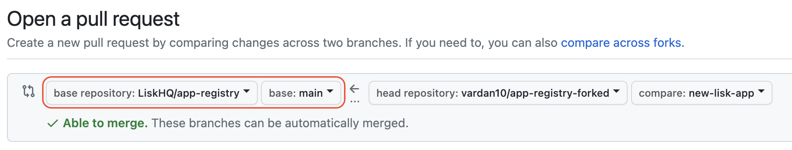
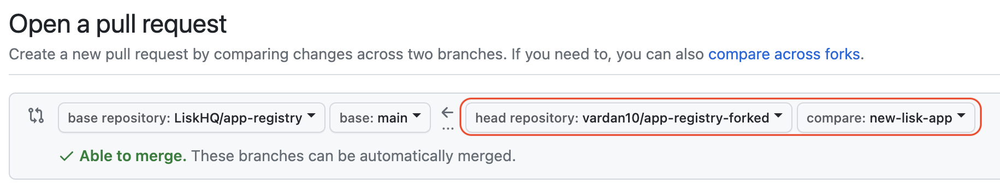

## Creating a pull request from a fork

1. Navigate to the forked repository.

2. Above the list of files, in the yellow banner, click the **Compare & pull request** button to create a pull request for the associated branch.
   

3. On the next page, click on the **compare across forks** link.
   

4. Next, set "base repository" to `LiskHQ/app-registry` and `base` to `main`.
   

5. Next, select your own repository as the `head repository` from the drop-down and set `compare` to the branch containing your changes.
   

6. Type a title and description for your pull request.

7. On user-owned forks, if you want to allow anyone with push access to the upstream repository to make changes to your pull request, select **Allow edits from maintainers**.

8. To create a pull request that is ready for review, click **Create Pull Request**. To create a draft pull request, use the drop-down and select **Create Draft Pull Request**, then click **Draft Pull Request**.

> **Note:** Please make sure to validate your PR to ensure that all GitHub Actions checks are passing. This will help ensure that your changes meet the project's quality standards and do not introduce any errors or issues.